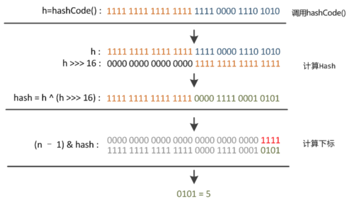

[toc]

# 使用`HashMap`的目的

存储`键值对`<Key-Value>

# 读写数据

既然涉及存储`键值对`，就需要对数据进行读写。我们在使用`HashMap`时，读写最常用的两个方法是：

- **读**	`public V get(Object key)`
- **写**	`public void put(Object key, Object value)`

## 写入数据

`HashMap`使用散列算法以空间换时间，令我们在可以用接近`随机访问RandomAccess`的方式读取数据。

### 哈希碰撞

由于使用散列算法，那么就可能产生`哈希碰撞`。为了避免`哈希碰撞`带来的问题，我们常常用

- 开放寻址法

  仅使用数组结构，当发生冲突时，地址进行一定偏移后得到一个新的地址。

- 链地址法/拉链法

  数组与链表结合使用，又称为`散列链表`。

而在`HashMap`中使用了`散列链表`。

### 为什么需要扩容

已知`HashMap`使用`散列链表`避免哈希冲突。首先采用数组存放元素<Value>，当存取元素较多时，数组就需要扩容以存放更多元素。

``` java
transient Node<K, V>[] table;
```

# 源码分析

## 成员常量与成员变量

``` java
public class HashMap<K,V> extends AbstractMap<K,V> implements Map<K,V>, Cloneable, Serializable {
    // 序列号
    private static final long serialVersionUID = 362498820763181265L;    
    // 默认的初始容量是16
    static final int DEFAULT_INITIAL_CAPACITY = 1 << 4;   
    // 最大容量
    static final int MAXIMUM_CAPACITY = 1 << 30; 
    // 默认的填充因子
    static final float DEFAULT_LOAD_FACTOR = 0.75f;
    // 当桶(bucket)上的结点数大于这个值时会转成红黑树
    static final int TREEIFY_THRESHOLD = 8; 
    // 当桶(bucket)上的结点数小于这个值时树转链表
    static final int UNTREEIFY_THRESHOLD = 6;
    // 桶中结构转化为红黑树对应的table的最小大小
    static final int MIN_TREEIFY_CAPACITY = 64;
    // 存储元素的数组，总是2的幂次倍
    transient Node<k,v>[] table; 
    // 存放具体元素的集
    transient Set<map.entry<k,v>> entrySet;
    // 存放元素的个数，注意这个不等于数组的长度。
    transient int size;
    // 每次扩容和更改map结构的计数器
    transient int modCount;   
    // 临界值 当实际大小(容量*填充因子)超过临界值时，会进行扩容
    int threshold;
    // 加载因子
    final float loadFactor;
}
```

## 确定哈希桶数组索引位置

| 符号 | 作用                  |
| ---- | --------------------- |
| >>   | 右移，高位补充符号位  |
| >>>  | 无符号右移，高位仅补0 |

`HashMap`中算法本质即三步：

1. 取<Key>的`hashCode`
2. 高位参与运算
3. 取模运算

### 扰动函数`hash()`

``` java
    static final int hash(Object key) {
      int h;
      // h = key.hashCode() 为第一步 取hashCode值
      // h ^ (h >>> 16)  为第二步 高位参与运算
      return (key == null) ? 0 : (h = key.hashCode()) ^ (h >>> 16);
  }
```

- 目的

  减少碰撞

- 步骤

  1. `h = key.hashCode())` 获取`hashCode`

  2. `h ^ (h >>> 16)` 高位参与运算

     

### `indexFor()`

> `JDK1.7`中的源码，`JDK1.8`中实现原理相同

``` java
static int indexFor(int h, int length) {
     //第三步 取模运算
     return h & (length-1);  
}
```

通过扰动函数完成第一、二步后，我们需要通过**模运算**将元素**分布相对均匀地**保存到`table`上。

但是由于使用`%`往往消耗较大，为了提高运算效率。首先保证`table`的长度总为2的n次方，在这种条件下，`h & (length - 1)`等价于`h % length`。

> `&`比`%`具有更高的效率。

## 写入`put()`

- `public void put(Object key, Object value)`

``` java
    public V put(K key, V value) {
        return putVal(hash(key), key, value, false, true);
    }
```

该方法调用了`putVal`方法。

## 写入核心方法`putVal()`

``` java
/**
* @param hash 经过扰动函数`hash()`得到的哈希值
* @param onlyIfAbsent 仅在缺失条件下保存元素
* @param evict 是否驱逐 || 为false时, table在创造模式
*/
final V putVal(int hash
               , K key
               , V value
               , boolean onlyIfAbsent
               , boolean evict) {
 	Node<K,V>[] tab; Node<K,V> p; int n, i;
    // table未初始化或者长度为0，进行扩容
    if ((tab = table) == null || (n = tab.length) == 0)
        n = (tab = resize()).length;
    // (n - 1) & hash 确定元素存放在哪个桶中，桶为空，新生成结点放入桶中(此时，这个结点是放在数组中)
    if ((p = tab[i = (n - 1) & hash]) == null)
        tab[i] = newNode(hash, key, value, null);
    // 桶中已经存在元素
    else {
        Node<K,V> e; K k;
        // 比较桶中第一个元素(数组中的结点)的hash值相等，key相等
        if (p.hash == hash &&
            ((k = p.key) == key || (key != null && key.equals(k))))
                // 将第一个元素赋值给e，用e来记录
                e = p;
        // hash值不相等，即key不相等；为红黑树结点
        else if (p instanceof TreeNode)
            // 放入树中
            e = ((TreeNode<K,V>)p).putTreeVal(this, tab, hash, key, value);
        // 为链表结点
        else {
            // 在链表最末插入结点
            for (int binCount = 0; ; ++binCount) {
                // 到达链表的尾部
                if ((e = p.next) == null) {
                    // 在尾部插入新结点
                    p.next = newNode(hash, key, value, null);
                    // 结点数量达到阈值，转化为红黑树
                    if (binCount >= TREEIFY_THRESHOLD - 1) // -1 for 1st
                        treeifyBin(tab, hash);
                    // 跳出循环
                    break;
                }
                // 判断链表中结点的key值与插入的元素的key值是否相等
                if (e.hash == hash &&
                    ((k = e.key) == key || (key != null && key.equals(k))))
                    // 相等，跳出循环
                    break;
                // 用于遍历桶中的链表，与前面的e = p.next组合，可以遍历链表
                p = e;
            }
        }
        // 表示在桶中找到key值、hash值与插入元素相等的结点
        if (e != null) { 
            // 记录e的value
            V oldValue = e.value;
            // onlyIfAbsent为false或者旧值为null
            if (!onlyIfAbsent || oldValue == null)
                //用新值替换旧值
                e.value = value;
            // 访问后回调
            afterNodeAccess(e);
            // 返回旧值
            return oldValue;
        }
    }
    // 结构性修改
    ++modCount;
    // 实际大小大于阈值则扩容
    if (++size > threshold)
        resize();
    // 插入后回调
    afterNodeInsertion(evict);
    return null;
}
```

## 扩容机制

- **扩容条件：** 当`table`长度大于`threshold`后，调用`resize()`进行扩容

- `threshold` =  `capacity` * `loadFactor`

  - `capacity` 当前容量，默认16
  - `loadFactor` 加载因子，默认0.75f。

  > loadFactor加载因子是控制数组存放数据的疏密程度，loadFactor越趋近于1，那么   数组中存放的数据(entry)也就越多，也就越密，也就是会让链表的长度增加，loadFactor越小，也就是趋近于0，数组中存放的数据(entry)也就越少，也就越稀疏。
  >
  > 
  >
  > **loadFactor太大导致查找元素效率低，太小导致数组的利用率低，存放的数据会很分散。loadFactor的默认值为0.75f是官方给出的一个比较好的临界值**。
  >
  > 
  >
  > 给定的默认容量为 16，负载因子为 0.75。Map 在使用过程中不断的往里面存放数据，当数量达到了 16 * 0.75 = 12 就需要将当前 16 的容量进行扩容，而扩容这个过程涉及到 rehash、复制数据等操作，所以非常消耗性能。

### JDK1.7

#### `resize()`

``` java
void resize(int newCapacity) {   //传入新的容量
     Entry[] oldTable = table;    //引用扩容前的Entry数组
     int oldCapacity = oldTable.length;         
     if (oldCapacity == MAXIMUM_CAPACITY) {  //扩容前的数组大小如果已经达到最大(2^30)了
         threshold = Integer.MAX_VALUE; //修改阈值为int的最大值(2^31-1)，这样以后就不会扩容了
         return;
     }
  
     Entry[] newTable = new Entry[newCapacity];  //初始化一个新的Entry数组
     transfer(newTable);                         //！！将数据转移到新的Entry数组里
     table = newTable;                           //HashMap的table属性引用新的Entry数组
     threshold = (int)(newCapacity * loadFactor);//修改阈值
 }
```

#### `transfer()`

``` java
 void transfer(Entry[] newTable) {
     Entry[] src = table;                   //src引用了旧的Entry数组
     int newCapacity = newTable.length;
     for (int j = 0; j < src.length; j++) { //遍历旧的Entry数组
         Entry<K,V> e = src[j];             //取得旧Entry数组的每个元素
         if (e != null) {
             src[j] = null;//释放旧Entry数组的对象引用（for循环后，旧的Entry数组不再引用任何对象）
             do {
                 Entry<K,V> next = e.next;
                 int i = indexFor(e.hash, newCapacity); //！！重新计算每个元素在数组中的位置
                 e.next = newTable[i]; //标记[1]
                 newTable[i] = e;      //将元素放在数组上
                 e = next;             //访问下一个Entry链上的元素
             } while (e != null);
         }
     }
 }
```

将原旧中元素转换给扩容之后的新数组。

### JDK1.8

#### `resize()`


# 参考

https://snailclimb.gitee.io/javaguide/#/docs/java/collection/Java集合框架常见面试题?id=listsetmap

- `HashMap`底层实现

https://zhuanlan.zhihu.com/p/149259104

https://zhuanlan.zhihu.com/p/21673805