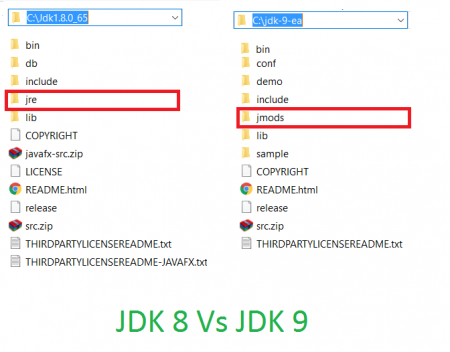

[toc]

# New Feature

- **Module System**
- **Modular JDK**

<hr>

- **REPL(JShell)**

  交互式编程环境，类似`python command`。

- **进程 API**

  通过`Process`、`ProcessHandle`及其嵌套接口`Info`来控制管理操作系统进程。

<hr>

不一一枚举了，直接看官网吧。

- **refer**
- [JDK 9](http://openjdk.java.net/projects/jdk9/)
- [JDK 9 Release Notes](https://www.oracle.com/java/technologies/javase/v9-issues-relnotes.html)

# Module

## 说在前面

`Modular`是JDK9最大的变化。

但如非必要，我不建议特地去学习。

- **refer**

- [Java 14都快出来了，为什么还有那么多人执着于Java 8？ - blindpirate的回答 - 知乎 ](https://www.zhihu.com/question/360985479/answer/956242314)

- [Java 14都快出来了，为什么还有那么多人执着于Java 8？ - 北南的回答 - 知乎](https://www.zhihu.com/question/360985479/answer/1451078193)
- [JDK 9 发布仅数月，为何在生产环境中却频遭嫌弃？](https://blog.csdn.net/csdnnews/article/details/78722304)

因为在学习`javafx13`的过程中在运行时有一个`bug`，是由于`modular`导致的。为了研究与弄清问题本质，所以才特地了解一下`Modular`。

在了解`Modular`的过程中，觉得这个功能比较鸡肋。`Java`真的要舍去自己的优势去和`python`与`nodejs`抢市场吗？也许编程语言真的有它的生命周期，`Java`正在渐渐老去。

`Oracle`真的要瞄准好`Java`的未来才是。

> - **Glavo**
>
>   个人感觉挺失望的。
>
>   <u>`Java 9`库上的改动很小，`API`上的变动更小，而语法新特性貌似一样都没有，所以对我来说，`Java 9`没有太大的吸引力。</u>

## Define

模块是一个被命名的代码与数据的自描述集合。

- 代码

- 数据

  `resource`和一些静态信息。

## Module JDK

- [JEP 200](http://openjdk.java.net/jeps/200)



`JDK 9`可以在编译、构建、运行期间进行组合。

它将运来复杂的`JDK`拆分成各个精简的模块。

- **查看JDK模块**

  ``` shell
  java --list-modules
  ```

此外，在我们使用模块化功能时，通过反编译`module-info.class`可见默认添加了`java.base`模块。

## Module System

- [JEP 261](http://openjdk.java.net/jeps/261)

### Phases

新增`link time`在编译阶段与运行阶段期间，用于装配和优化一个自定义`run-time image`——运行镜像，并提供连接工具`jlink`。

### Motivation

基于`Jigsaw`实现，令`Java`程序更容易扩展到小型设备上。

## Declare

`模块`的自描述表现其声明中。

``` java
module com.foo.bar{
    requires org.baz.qux;
    exports com.foo.bar.alpha;
    exports com.foo.bar.beta;
}
```

- **requires**	表明`com.foo.bar`模块依赖其他模块。

- **exports**	指定`package`中的`public `可以被其他模块使用。

- **opens**	指定开放包

- **open**	指定开放模块

- **uses**	使用接口的名字，实现可由其他模块提供

- **provides .. with...**	指定一个或多个接口的实现类

  ``` java
  module java.computer{
      provieds com.computer.Icomputer with com.computter.impl.Dell;
  }
  ```

按照约定，模块声明文件`module-info.java`在`root目录`下。

# jlink

`Modular`是为了更容易地扩展至小型设备上。如果我们的程序依然使用原来巨大的`jdk/jre`那么毫无意义。

所以`java 9`新增了`jlink`工具以简化`jre`，它将按需生成`jre`。

> 裁剪后的`jre`应该又被称为`run-time image`。

- **查看项目模块**

  ``` shell
  jdepts --list-deps Helloworld.jar
  ```

- **裁剪**

  ``` java
  jlink --module-path jmods --add-modules java.base --output minijre
  ```

> `java.base`是最基础的模块，所有模块依赖它。

# jmod

自`jdk 9`后，其目录结构发生改变。多了一个`jmods`文件夹，里面有很多`*.jmod`。

`*.jmod`本质是压缩包，里面包含了`*.class`和其他资源文件。

- **jar >> jmod**

  ``` shell
  jmod create --class-path Helloworld.jar Helloworld.jmod
  ```

- **运行**

  ``` shell
  java --module-path hello.jar --module hello.world
  ```

# FAQ

## lombok无法编译通过