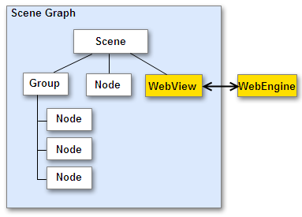

[toc]

# 引言

> - **2021-1-27**
>
>   之前用`swing`做了一款`ReentrantReadWriteLock`的演示工具。
>
>   同时想将做把更多的并发工具做成演示程序，帮助自己与大家学习理解。
>
>   但发现自己原来写的代码太烂了。由于当时想以后慢慢再迭代，为求方便只考虑了`读写锁`的演示程序，再看代码觉得难以入手。其次自己对`swing`理解真的不深入，也觉得没有必要去细细研究。
>
>   所以打算学习一下`javafx`，看看是否能更优雅地完成这个项目。

-  **参考**
-  [JavaFX 15](https://openjfx.cn/index.html)
-  [JavaFX中文资料](http://www.javafxchina.net/blog)
- [JavaFX 教程 （中文）](https://code.makery.ch/zh-cn/library/javafx-tutorial/)

# 概述

- **什么是`javafx`**

  我觉得`javafx`就是一个`java`实现的ui类库。

  但是这个网站说了一大堆[DOC-01-01 JavaFX概览](http://www.javafxchina.net/blog/2015/06/doc01_overview/)。

  有兴趣的读者可以看看。
  
- **架构图**

  

# Application

`Application.launch(args)`是阻塞方法。这样才能在显示窗口的程序不退出。

``` java
log.debug("******** start ********");
Application.launch(UIAlignmentApplication.class, args);
Application.launch(SameSizeButtonApplication.class, args);
log.debug("******** end ********");
```

# 场景图

## Stage 舞台

`Stage`是在`JavaFX`中最为常见的顶级容器，继承自`Window`类。

- **Window声明**

  `javafx`顶级容器的实现类，通常我们调用它的`setScene(Scene)`方法，把`场景`交给它托管。`Window objects`将被`JavaFX Application Thread`构造与创建。

-  **Stage声明**

  ``` java
  public class Stage extends Window {}
  ```

## Scene 场景图

`Scene Graph`，是构建`JavaFX`应用的入口。它是一个树状结构，包含一个根结点。

## Node

- **声明**

  ``` java
  @IDProperty("id")
  public abstract class Node implements EventTarget, Styleable {}
  ```

  每个节点都具有一个`id`、`样式类`(见`Styleable`)与`包围盒`。除了`Window`与`Scene`外，所有元素本质都是`Node`，即使是`Pane`。

# 控件

控件内容很多，简单得不想说。

# WebView

`javafx`内嵌浏览器，基于开源`Web`浏览器引擎`Webkit`。

## 作用

- 加载本地或远程`URL`的`HTML`内容
- 获取`Web`历史
- 执行`Javascript`脚本
- 执行由`Javascript`向上调用`javafx`
- 管理`web`上的弹出式`pop-up`窗口
- 为内嵌浏览器应用特效

## 架构



### WebEngine

提供基本的`web`页面功能。

### WebView

是`Node`的扩展，封装了`WebEngine`。负责将`HTML`内容加入程序的场景中，并提供各种属性和方法来应用特效和变换。

# 布局

## 内置布局

面板是一种布局容器。

<hr>

- **BorderPane**

  从以`Border`命名来看，大概就是一个中心四条边的经典布局。

  通常，上方作为菜单来和工具栏，下方是状态栏，左边是导航栏，右边是附加信息面板，中间是核心工作区域。

  当`BorderPane`所在窗口比各区域内容所需空间大时，将多出的空间默认设置给中间区域。

  当窗口大小比各区域所需空间小时，各个区域就会重叠。重叠的顺序取决于各个区域设置的顺序。例如，如果各个区域设置的顺序是左、下、右，则当窗口变小时，下方区域会覆盖左边区域，而右边区域会覆盖下方区域。如果区域设置顺序是左、右、下，当窗口变小时，下方区域则会在覆盖到左边和右边区域之上。

- **水平盒子(HBox)**

- **垂直盒子(VBox)**

- **栈面板(StackPane)**

  将所有的节点放在一个堆栈中进行布局管理，后添加的节点会显示在前一个节点之上。

- **网格面板(GridPane)**

- **流面板(FlowPane)**

- **磁贴面板(TilePane)**

- **锚面板(AnchorPane)**

  `AnchorPane`布局面板可以让你将节点锚定到面板的顶部、底部、左边、右边或者中间位置。当窗体的大小变化时，节点会保持与其锚点之间的相对位置。一个节点可以锚定到一个或者多个位置，并且多个节点可以被锚定到同一个位置。

##  调整节点大小与对齐

使用`javafx`内置布局面板的主要好处是<u>`node`的大小和对齐方式是由布局面板控制的</u>。

### 调整节点大小

布局通过以下两个方法得到`Node`的预设大小`PreferredSize`：

- **prefWidth(height)**
- **prefHeight(width)**

1. 在默认情况下，UI控件会根据其所包含的内容来自动计算**预设大小属性的默认值**。

   例如，按钮`(Button)`被计算出来的大小取决于标签文本的长度和字体大小，再加上按钮图标的大小。一般来说，计算出来的大小刚好能让控件及其标签完全显示可见。

2. UI控件根据其典型用途还提供了**默认的最小和最大值**。

   例如，`Button`的默认最大值就是其预设大小，因为一般来说你不会想让按钮任意变大。然而`ScrollPane`的最大值却是不受限制的，因为一般来说你会希望它们能够变大并充满所有的可用空间。

### 对齐内容

每个布局面板都有一个默认的对齐方式，比如说：在`VBox`中，`Node`是居上对齐；在`HBox`中，`Node`是居左对齐。

通常，我们可以使用`Pane`的`setAlignment(Pos)`来控制`Node`和`Pane`的对齐方式。对齐属性常量有以下枚举类型可选：

- **HPos**	水平对齐方式
- **Pos**	水平与垂直对齐方式
- **VPos**	垂直对齐方式

但实际上，`setAlignment(Pos)`并不支持传入参数为`VPos`或`HPos`，而且构造方法声明为`private`。我们并不能自定义`Pos`的属性，只能以下形式来传入`Pos`：

``` java
VBox pane = new VBox();
pane.getChildren().add(new Button("一个按钮"));
pane.setAlignment(POS.center);
```

挺好的，避免程序员乱来。说明`javafx`封装得还是不错的。

# CSS

`css`可用于布局或调整样式。

`javafx`默认的`stylesheet`是`modena.css`。

- **解压并查看`modena.css`**

``` bat
jar xf jfxrt.jar com/sun/javafx/scene/control/skin/modena/modena.css
```

- **覆盖.root样式类**

可以通过修改`.root`样式类快速更改界面外观。`.root`将应用到`Scene`实例的`root node`。由于`scene`的所有`node`都在该`root node`中，所以`.root`样式类中的`style`将被应用到所有的`node`上。

但需要注意的是，在我们根结点为`Group`类型时不生效。

## 添加样式表

``` java
Scene scene = new Scene(new Group(), 500, 400);
scene.getStylesheets().add(getClass().getResource("/css/test.css").toString());
```

# FAQ

## 错误: 缺少 JavaFX 运行时组件, 需要使用该组件来运行此应用程序

在`debug`时发生这个错误，但是从`javafx-archetype-fxml`这个模板直接拉下来的项目并没有发生这个问题。同样的，在直接运行时也没有问题。

这是`Java 9`新特性模块化导致的。

- **参考**

  [在 Intellij IDEA 里使用 OpenJFX (JavaFX)](https://my.oschina.net/tridays/blog/2222909)

  [jdk11 + maven 打包JavaFX11](https://blog.csdn.net/xizi1103/article/details/104015406)

## maven clean compile package javafx:run 报错: -release无法解析

将`maven`所使用的`jdk`换成`jdk15`。