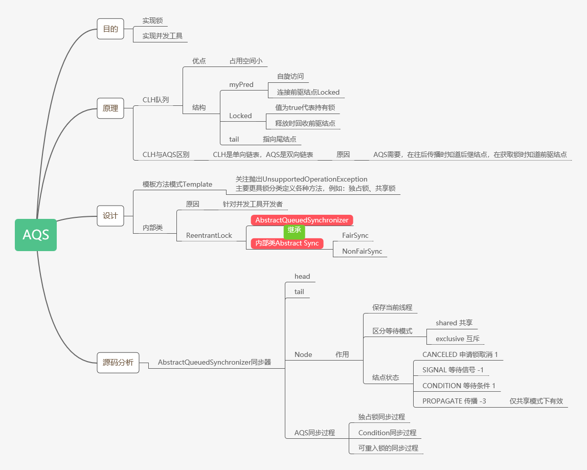
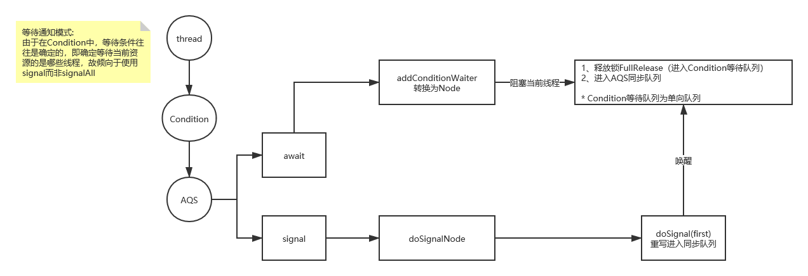

[toc]

# 显式锁

- 什么是显式锁

使用 synchronized 关键字时，线程隐式地获取锁。

而与之相对应的则是显式锁——Lock。

> 当一个线程死亡时，其持有所有线程将释放。

## Lock的特性

有了`synchronized`为什么还需要`Lock`？

`synchronized`固定了线程对锁获取与释放的过程，有时候我们需要更灵活地获取与释放锁，这时候就需要Lock。

- 尝试非阻塞地获取锁

  使用`lock.tryLock()`。

  使用`synchronized`时，直至线程获取锁，否则一直处于阻塞状态。

- 能被中断地获取锁

  使用`lock.lockInterruptibly()`。

  当线程处于阻塞状态时不可被中断。

- 超时获取锁

## Lock与synchronized区别

- `synchronized`是`java`关键字，`Lock`是`java`接口；
- `synchronized`不需要用户手动释放锁，`Lock`需要用户手动释放锁，否则可能导致死锁现象；
- `synchronized`为隐式锁，`Lock`为显式锁；
- `synchronized`是不可中断锁，`Lock`是可中断锁；
- `synchronized`未非公平锁，`Lock`默认情况下为非公平锁，但可设置公平锁；
- `Lock`可返回是否获得锁；
- `Lock`可设置等待锁时间；
- `synchronized`消耗更小，所以在一般情况使用`synchronized`

> 在JDK8中，`synchronized`性能有所提升，与`Lock`相当接近，故在JDK8及以后更推荐使用`synchronized`。

## Lock标准用法

``` java
lock.lock()
try {
    count++
} catch (Exception e) {
    
} finally {
    // 无论是否存在异常均要释放锁
    lock.unlock();
}
```

> 不要将`lock.lock()`写在`try代码块`中，因为如果在获取锁的过程时发生了异常，异常在抛出同时，将导致锁的无故释放。

## 常用`API`

| method                                                       | description                                                  |
| ------------------------------------------------------------ | ------------------------------------------------------------ |
| `void lock()`                                                | 获取锁                                                       |
| `void lockInteerruptibly() throws InterruptedException`      | 可中断地获取锁                                               |
| `boolean tryLock()`                                          | 非阻塞地获取锁                                               |
| `boolean tryLock(long time, TimeUnit unit) throws InterruptedException` | 当前线程在超时时间内获取锁、超时间内被中断和超时时间结束（返回false）三种情况下将返回 |
| `void unlock()`                                              | 释放锁                                                       |

- 通过`tryLock`来获取锁

  ``` java
  Lock lock = new ReentrantLock();
  if (lock.tryLock()) {
      try {
          // 处理任务
      } catch(Exception ex) {
          
      } finally{
          lock.unlock(); // 释放锁
      }
  } else {
      // 如果不能获得锁，则处理其他任务
  }
  ```

# 可重入锁`ReentrantLock`

## 什么是可重入锁

一个线程对于已经获得的锁，可以多次继续申请到该锁的使用权。

- `synchronized`与`ReentrantLock`均为可重入锁

  `synchronized`隐式支持可重入，例如`synchronized`修饰递归方法，在方法执行时，执行线程在获取了锁之后仍然连续多次地获得该锁。

  `ReentrantLock`在调用`lock()`时，已经获取到锁地线程，能够再次调用`lock()`获取锁而不被阻塞。

## 公平锁与非公平锁

如果线程获取锁的顺序，根据对锁请求的时间先后来计算，那么这个锁是公平锁。

- `ReentrantLock`默认为非公平锁

  `public ReentrantLock(boolean fair)`

  ``` java
  // 令ReentrantLock为公平锁
  Lock lock = new ReentrantLock(true);
  ```

- 公平锁效率没有非公平锁高。

  这是因为**恢复一个挂起的线程与该线程真正开始运行之间存在严重的延迟**。

  > CPU上下文切换需要约5000~10000 CPU时间周期。

  假设线程A持有一个锁，并且线程B请求这个锁。

  由于这个锁已被线程A持有，因此B将被挂起。当A释放锁时,B 将被唤醒，因此会再次尝试获取锁。

  与此同时，如果C也请求这个锁，那么C很可能会在B被完全唤醒之前获得、使用以及释放这个锁。这样的情况是一种"双赢"的局面：B获得锁的时刻并没有推迟，C更早地获得了锁,并且**吞吐量也获得了提高**。

# 读写锁`ReentrantReadWriteLock`

``` java
/**
* ReentrantReadWriteLock并没有实现Lock接口
* ReadWriteLock也并不是Lock的子类
*/
public class ReentrantReadWriteLock
        implements ReadWriteLock, java.io.Serializable
```

互联网中有很多**读多写少**的场景。

例如在数据库领域，存在读多写少的情况，我们常常做读写分离。

人们将读写分离的思想应用于多线程领域，于是有了读写锁（`ReentrantReadWriteLock`）。

读写锁维护了一对锁——读锁和写锁，通过分离了读锁和写锁在保证线程安全的同时，提高了并发性。

- 读锁——共享锁

  在同一时刻允许多个线程持有共享锁，但排斥写锁。

- 写锁——排他锁

  在同一时刻仅允许一个线程访问，其他线程均被阻塞。

> 排他锁又称独占锁。

此外，读写锁简化了读写交互场景的编程方式。

## 代码应用

- 商品

  ``` java
  /**
   *类说明：商品的实体类
   */
  public class GoodsInfo {
      private final String name;
      private double totalMoney;//总销售额
      private int storeNumber;//库存数
  
      public GoodsInfo(String name, int totalMoney, int storeNumber) {
          this.name = name;
          this.totalMoney = totalMoney;
          this.storeNumber = storeNumber;
      }
  
      public double getTotalMoney() {
          return totalMoney;
      }
  
      public int getStoreNumber() {
          return storeNumber;
      }
  
      public void changeNumber(int sellNumber){
          this.totalMoney += sellNumber*25;
          this.storeNumber -= sellNumber;
      }
  }
  
  ```

- 商品服务接口

  ``` java
  /**
   *类说明：商品的服务的接口
   */
  public interface GoodsService {
  
  	public GoodsInfo getNum() throws InterruptedException;//获得商品的信息
  	public void setNum(int number) throws InterruptedException;//设置商品的数量
  }
  ```

- 使用`synchronized`实现接口

  ``` java
  import java.util.concurrent.TimeUnit;
  
  /**
   *类说明：用内置锁来实现商品服务接口
   */
  public class UseSyn implements GoodsService {
  	
  	private GoodsInfo goodsInfo;
  	
  	public UseSyn(GoodsInfo goodsInfo) {
  		this.goodsInfo = goodsInfo;
  	}
  
  	@Override
  	public synchronized GoodsInfo getNum() throws InterruptedException {
  		TimeUnit.MICROSECONDS.sleep(5);
  		return this.goodsInfo;
  	}
  
  	@Override
  	public synchronized void setNum(int number) throws InterruptedException {
  		TimeUnit.MICROSECONDS.sleep(5);
  		goodsInfo.changeNumber(number);
  
  	}
  
  }
  
  ```

- 使用`ReentrantReadWriteLock`

  ``` java
  package org.hc.learning.thread.lock.readwrite;
  
  import java.util.concurrent.TimeUnit;
  import java.util.concurrent.locks.Lock;
  import java.util.concurrent.locks.ReadWriteLock;
  import java.util.concurrent.locks.ReentrantReadWriteLock;
  
  /**
   * 类说明：
   */
  public class UseRwLock  implements GoodsService{
  
      private GoodsInfo goodsInfo;
  
      private final ReadWriteLock lock = new ReentrantReadWriteLock();
      private final Lock getLock = lock.readLock();//读锁
      private final Lock setLock = lock.writeLock();//写锁
  
      public UseRwLock(GoodsInfo goodsInfo) {
          this.goodsInfo = goodsInfo;
      }
  
      @Override
      public GoodsInfo getNum() throws InterruptedException {
          getLock.lock();
          try{
              TimeUnit.MICROSECONDS.sleep(5);
              return this.goodsInfo;
          } finally {
              getLock.unlock();
          }
      }
  
      @Override
      public void setNum(int number) {
          setLock.lock();
          try{
              TimeUnit.MICROSECONDS.sleep(5);
              goodsInfo.changeNumber(number);
          } catch (InterruptedException e) {
              e.printStackTrace();
          } finally {
              setLock.unlock();
          }
      }
  }
  ```

- Main类

  ``` java
  import java.util.Random;
  import java.util.concurrent.TimeUnit;
  
  /**
   *类说明：对商品进行业务的应用
   */
  public class BusiApp {
      static final int readWriteRatio = 10;//读写线程的比例
      static final int minthreadCount = 3;//最少线程数
      //读操作
      private static class GetThread implements Runnable{
  
          private GoodsService goodsService;
          public GetThread(GoodsService goodsService) {
              this.goodsService = goodsService;
          }
  
          @Override
          public void run() {
              long start = System.currentTimeMillis();
              for(int i=0;i<100;i++){//操作100次
                  try {
                      goodsService.getNum();
                  } catch (InterruptedException e) {
                      e.printStackTrace();
                  }
              }
              System.out.println(Thread.currentThread().getName()+"读取商品数据耗时："
               +(System.currentTimeMillis()-start)+"ms");
  
          }
      }
  
      //写操做
      private static class SetThread implements Runnable{
  
          private GoodsService goodsService;
          public SetThread(GoodsService goodsService) {
              this.goodsService = goodsService;
          }
  
          @Override
          public void run() {
              long start = System.currentTimeMillis();
              Random r = new Random();
              for(int i=0;i<10;i++){//操作10次
                  try {
                      TimeUnit.MICROSECONDS.sleep(5);
                  } catch (InterruptedException e) {
                      e.printStackTrace();
                  }
                  try {
                      goodsService.setNum(r.nextInt(10));
                  } catch (InterruptedException e) {
                      e.printStackTrace();
                  }
              }
              System.out.println(Thread.currentThread().getName()
              		+"写商品数据耗时："+(System.currentTimeMillis()-start)+"ms---------");
  
          }
      }
  
      public static void main(String[] args) throws InterruptedException {
          GoodsInfo goodsInfo = new GoodsInfo("Cup",100000,10000);
          GoodsService goodsService = new UseSyn(goodsInfo);
          /*GoodsService goodsService = new UseRwLock(goodsInfo);*/
          for(int i = 0;i<minthreadCount;i++){
              Thread setT = new Thread(new SetThread(goodsService));
              for(int j=0;j<readWriteRatio;j++) {
                  Thread getT = new Thread(new GetThread(goodsService));
                  getT.start();           	
              }
              Thread.sleep(5);
              setT.start();
          }
      }
  }
  ```

  能明显感受出使用`synchronized`和读写锁在解决该问题时效率上的区别。

# `Condition`接口

相比直接使用作为锁资源的`wait()`与`notify()`方法，在多个条件下使用`Condition`的代码可读性更好。

同时，由于在多个条件下使用`Condition`，可能导致锁的获取与释放更加频繁，最终导致`CPU`上下文切换更加频繁，从而引起性能下降。

## 同步队列与等待队列

- **同步队列**

  等待锁资源的队列

- **等待队列**

  在等待/通知模型中，当条件满足时才被唤醒的线程组成的队列，被唤醒后重回同步队列。

详细见`AQS`章节。

## 常用方法

| method                          | explain                                                      |
| ------------------------------- | ------------------------------------------------------------ |
| `void await()`                  | 作用类似`Object`的`wait()`。当前线程进入等待状态直到被通知或中断。 |
| `void awaitUninterruptibly()`   | 当前线程进入等待状态直到被通知。对中断不敏感。               |
| `long awaitNanos(long)`         | 当前线程进入等待状态直到被通知、中断或超时。返回值表示剩余时间。 |
| `boolean await(long, TimeUnit)` |                                                              |
| `boolean awaitUntil(Date)`      | 当前线程进入等待状态直到被通知、中断或到某个时间。如果没有到指定时间就被通知，方法返回true。 |
| `void signal()`                 | 作用类似`Object`的`notify()`。唤醒一个等待在`Condition`上的线程，该线程从等待方法返回且必须获得**与Condition相关联**的锁 |
| `void signalAll()`              | 作用类似`Object`的`notifyAll()`                              |

## 使用范式

``` java
Lock lock = new ReentrantLock();

/**
* 通过锁实例获取
*/
Condition condition = lock.newCondition();

public void conditionWait() throws InterruptedException {
    lock.lock();
    try{
        condition.await();
    } finally {
        lock.unlock();
    }
}

public void conditionSignal() throws InterruptedException {
    lock.lock();
    try {
        condition.signal();
    } finally {
        lock.unlock();
    }
}
```

​    首先，我们通过`Lock`接口的得到`Condition`，再通过`signal()`与`notify()`控制将线程放在**同步队列**或者**等待队列**上。

> 另外在使用时，我们需要注意调用`Condition.signal`操作后，只是将**等待队列**上的`head`（等待时间最长的结点）放到同步队列上。不要想当然的以为一定来自**等待队列**。

```java
public class ReentrantLock implements Lock, java.io.Serializable {

...
/*
* 返回一个Condition对象
*/
public Condition newCondition() {
    return sync.newCondition();
}

...
}
```
# LockSupport并发工具类

<font color='red'>构建同步组件的基本组件。</font>

`LockSupport`定义了一组的公共静态方法，这些方法提供了最基本的线程阻塞和唤醒功能，而`LockSupport`也成为构建同步组件的基础工具。

`LockSupport`定义了一组以`part*`命名的方法来阻塞线程，以及以`unpart*(Thread thread)`方法来唤醒一个被阻塞的线程。

在`JDK6`后`LockSupport`增加了以下带参方法

- `park(Object blocker)`
- `parkNanos(Object block, long nanos)`
- `parkUntil(Object blocker, long deadline)`

> 最初仅`park()`与`unpark()`两个无参方法，造成程序员在调试时，无法得知当前线程。
>
> 于是在`JDK1.6`后增加带参方法。

用于阻塞当前线程的功能，其中参数`blocker`是用来表示当前线程在等待的对象(阻塞对象)，该对象主要用于问题排查和系统监控。

- **park：**停车

# CLH队列锁

`Craig, Landin, and Hagersten locks`

- **目的** 解决多个线程竞争锁

我们常用的PC机，比如服务器、笔记本，大部分都使用`CLH队列锁`。

<font color='red'>CLH队列锁是一种基于链表的可扩展、高性能、公平的`自旋锁`</font>，`申请线程`仅仅在<u>本地变量</u>（当前结点的`myPred`）上自旋，不断轮询前驱的状态，假设发现前驱释放了锁就结束自旋。

其中每个结点包含两个域

- **myPred：** 指向前驱结点的`locked`
- **locked：** 如果为`true`表示需要获取锁
- **tail：** 始终指向最后加入的线程/结点

`myPred`将不断自旋检测前驱结点的`locked`，当`locked`为`false`时，表明前驱结点所代表的线程将锁释放，同时回收前驱结点。

## 优点

CLH队列锁的优点是空间复杂度低。

~~如果有n个线程，L个锁，每个线程每次只获取一个锁，那么需要的存储空间是 O(L+n)，n个线程有n个node，L个锁有L个tail~~。 

> 20201216
>
> 这里应该Mark老师在百度上直接拷贝过来的，没有仔细研读。
>
> 如果L个锁有L个tail，那么CLH队列将会变成一个树结构，这和CLH队列的名称是冲突的。
>
> 其次在变成树结构后，子树无法区分到底其父亲结点获取了哪些锁，释放了哪些锁。
>
> 所以，笔者认为以上这句话不太合适，为避免引起歧义，应该删去。

`AQS`是CLH队列锁的变体实现。

## 扩展：SMP体系架构

CLH队列锁常用于`SMP体系架构`下。

> SMP(SymmetricMulti-Processor) 。即对称多处理器结构 ，指 server中多个CPU对称工作，每一个CPU访问内存地址所需时间相同。其主要特征是共享，包括对CPU，内存，I/O等进行共享。SMP的长处是可以保证内存一致性。缺点是这些共享的资源非常可能成为性能瓶颈。随着CPU数量的添加，每一个CPU都要访问同样的内存资源，可能导致内存问冲突，可能会导致CPU资源的浪费。经常使用的PC机就属于这样的。
>
> 非一致存储访问，将CPU分为CPU模块，每个CPU模块由多个CPU组成，并且具有独立的本地内存、I/O槽口等，模块之间可以通过互联模块相互访问，访问本地内存（本CPU模块的内存 ）的速度将远远高于访问远地内存 ( 其他CPU模块的内存)的速度，这也是非一致存储访问的由来。NUMA较好地解决SMP的扩展问题，当CPU数量增加时，因为访问远地内存的延时远远超过本地内存，系统性能无法线性增加。
>
> CLH唯一的缺点是NUMA系统结构下性能很差，但是在SMP系统结构下该法还是非常有效的。解决NUMA系统结构的思路是MCS队列锁 。

# AQS(`AbstractQueuedSynchronizer`)



队列同步器

## AQS的重要性

AQS是用来构建锁或者其他同步组件的基础框架。

- **CountDownLatch**
- **ThreadPoolExecutor**
- **SelfLock**
- **ReentrantLock**
- **TrinityLock**
- **ReenterSelfLock**
- **ReentrantReadWriterLock**
- **Semaphore**

`AQS`使用一个`int`成员变量表示同步状态，通过内置的`FIFIO队列`来完成`资源获取线程`的排队工作。

> 并发包的大师DougLea期望它能够成为实现大部分同步需求的基础。

## AQS的使用方式和其中的设计模式

- 使用方式

  `AQS`的主要使用方式是继承。`AQS`面向的是并发工具的实现者，而非使用者，所以往往令子类作为静态内部类并继承`AQS`。

- 设计模式

  模板方法模式

## AQS中的方法

### 模板方法

- **void acquire(int arg)**:	获取同步状态
- **void acquireInterruptibly(int arg)**:	获取同步状态，可响应中断。
- **boolean tryAcquireNanos(int arg, long nanos)**:	在`acquireInterruptibly`基础上增加超时限制。
- **void acquireShared(int arg)**:	共享锁获取同步状态
- **void acquireSharedInterruptibly(int arg)**:	共享锁获取同步状态，可响应中断。
- **boolean tryAcquireSharedNanos(int arg)**:	共享锁获取同步状态
- **boolean release(int arg)**:	释放同步状态
- **boolean releaseShared(int arg)**	共享式的释放同步状态
- **Collection<Thread> getQueuedThreads()**:	获取等待队列上的线程集合

### 可重写的方法

- **protected boolean tryAcquire(int arg)**:	独占式获取同步状态
- **protected boolean tryRelease(int arg)**:	独占式释放同步状态
- **protected int tryAcquireShared(int arg)**:	共享式释放同步状态
- **protected boolean tryReleaseShared(int arg)**:	共享式释放同步状态
- **protected boolean isHeldExclusively()**:	当前同步器释放在独占模式下被线程占用，一般表示是否被当前线程占用。

### 访问或修改同步状态的方法

- **getState()**:	获取当前同步状态
- **setState(int new State)**:	设置当前同步状态
- **compareAndSetState(int expect, int update)**:	使用CAS设置当前状态，该方法能够保证状态设置的原子性

## 源码解析

### head

`head`是获取同步状态成功的结点，`head`在释放同步状态(`release`)时将唤醒后继结点，而后继结点将会在获取同步状态成功时将自己设置为`head`。

设置`head`是**获取同步状态成功的线程**来完成的，由于已经获取成功且获取这部分的代码是线程安全的，所以设置`head`的代码并不需要使用`CAS`来保证。

> head结点不保存线程信息，在数据结构中，这种做法叫做`空头结点链表`。

### tail

### state

- 当`state`小于或等于0时意味着当前线程可获取锁

- 当`state`大于0时代表该可重入锁获取到该锁资源。

> 20201216
>
> 以上为JDK大部分场景的用法，我们可以根据业务逻辑自定义实现。

``` java
// ReentrantLock 281 line
else if (current == getExclusiveOwnerThread()) {
    int nextc = c + acquires;
    if (nextc < 0)
        throw new Error("Maximum lock count exceeded");
    setState(nextc);
    return true;
}
```

### AQS中的数据结构 Node

在`AQS`队列中，往往每一个结点代表一个线程。我们通过`Node`保存以下信息：

#### 成员变量

- **waitStatue**:	线程在队列中的状态
- **prev**:	该变量类型为Node对象，前驱结点
- **next**:	该变量类型为Node对象，后继结点
- **thread**:	该变量类型为Thread对象
- **nextWaiter**:	该变量类型为Node对象，表示等待`condition`条件的结点

#### 线程的等待模式 

- **SHARED**:	共享模式
- **EXCLUSIVE**:	独占模式

#### 线程在队列中的等待状态 waitStatue

- **CANCELED**:	值为1，表示线程获取锁的请求已经“取消”。
- **SINGAL**:	值为-1，表示线程准备就绪，等待资源（锁）空闲。
- **CONDITION**:	值为-2，表示线程等待某个条件被满足。
- **PROPAGATE**：值为-3，仅线程处于共享模式，才会被使用。

> 初始Node对象时，默认为0。

### 独占锁同步状态的获取与释放


#### 获取

通过`AQS`的`acquire(int arg)`可以获取同步状态，主要完成了以下工作：

``` java
public final void acquire(int arg) {
    if (!tryAcquire(arg) &&
        acquireQueued(addWaiter(Node.EXCLUSIVE), arg))
        selfInterrupt();
}
```

- 同步状态的获取 `tryAcquire(int arg)`

  ``` java
  protected final boolean tryAcquire(int acquires) {
      final Thread current = Thread.currentThread();
      int c = getState();
      if (c == 0) {
          if (!hasQueuedPredecessors() &&
              compareAndSetState(0, acquires)) {
              setExclusiveOwnerThread(current);
              return true;
          }
      }
      else if (current == getExclusiveOwnerThread()) {
          int nextc = c + acquires;
          if (nextc < 0)
              throw new Error("Maximum lock count exceeded");
          setState(nextc);
          return true;
      }
      return false;
  }
  ```

- 结点构造 `addWaiter(Node node)`

  封装为`Node`，如果队列不为空，则尝试将当期结点加入队列尾部，不成功调用`end(Node node)`方法：

  ``` java
  private Node enq(final Node node) {
      // 自旋
      for (;;) {
          Node t = tail;
          /*
          * 1.队列为空 初始化队列
          * 	实例化一个空结点，并让`head`、`tail`都指向这个空结点
          * 2.将当前结点加入队列尾部
          */
          if (t == null) { // Must initialize
              if (compareAndSetHead(new Node()))
                  tail = head;
          } else {
              node.prev = t;
              if (compareAndSetTail(t, node)) {
                  t.next = node;
                  return t;
              }
          }
      }
  }
  ```

  

- 加入同步队列中自旋 `acquireQueued(Node node, int arg)`

``` java
final boolean acquireQueued(final Node node, int arg) {
    boolean failed = true;
    try {
        boolean interrupted = false;
        // 自旋
        for (;;) {
            final Node p = node.predecessor();
            // 如果前驱结点是`head`且获取同步状态成功
            if (p == head && tryAcquire(arg)) {
                setHead(node); // 设置为`head`
                p.next = null; // help GC
                failed = false;
                return interrupted;
            }
            // 线程进入阻塞状态，等待被唤醒
            if (shouldParkAfterFailedAcquire(p, node) &&
                parkAndCheckInterrupt())
                interrupted = true;
        }
    } finally {
        if (failed)
            cancelAcquire(node);
    }
}
```

`acquire(int arg)`是一个被`final`关键字修饰的方法，不可被子类重写。

在自旋过程中，只有前驱结点是`head`才能够尝试获取同步状态，原因如下：

- `head`是成功获取同步状态的结点，`head`的释放将唤醒其后继结点，后继结点被唤醒后**需要检查自己的前驱结点是否为`head`**
- 维护同步队列的`FIFO原则`

#### 释放

当线程需要释放同步状态时，调用`Lock.unlock()`方法。而`unlock()`往往是通过`AQS`的`release(int arg)`实现的。`release(int arg)`释放同步状态后，回唤醒其后继结点。

``` java
public final boolean release(int arg) {
    if (tryRelease(arg)) {
        Node h = head;
        // 结点状态不为0
        if (h != null && h.waitStatus != 0)
            // 唤醒h结点的后继结点
            unparkSuccessor(h);
        return true;
    }
    return false;
}
```

- **unparkSuccessor(Node node)**

``` java
/**
     * Wakes up node's successor, if one exists.
     *
     * @param node the node
     */
private void unparkSuccessor(Node node) {
    int ws = node.waitStatus;
    // 结点状态不为CANCEL或者INIT
    if (ws < 0)
        compareAndSetWaitStatus(node, ws, 0);
    Node s = node.next; // 获取head的后继结点
    if (s == null || s.waitStatus > 0) { // 后继结点为空或后继结点为取消状态
        s = null;
        // 从后往前遍历，寻找未取消的结点
        for (Node t = tail; t != null && t != node; t = t.prev)
            if (t.waitStatus <= 0)
                s = t;
    }
    if (s != null)
        // 唤醒
        LockSupport.unpark(s.thread);
}
```

当`head`后继结点为`CANCEL`状态时，意味着同步资源竞争较大，队列第一个结点等待很久，（比如在非公平锁中，总是被还未加入队列的节点抢走锁），那么推测后续结点被取消的几率也比较大，所以从尾部开始遍历，找到未被取消的结点。

#### 总结

- `head`总为获取同步状态成功的结点
- 获取同步状态时，获取失败的线程加入同步队列尾部进行自旋
- 移出队列的条件是前驱结点为`head`
- 释放成功将唤醒`head`后继结点

### 共享锁同步状态的获取与释放

> `Semaphore`即为共享锁的一种实现。

共享锁需要实现`AQS`的`tryAcquireShared(Node node)`以尝试获取锁。

其返回值为`int`类型，在返回结果大于0时表示成功获取同步状态，失败后调用`AQS`的私有方法`doAcquireShared(int arg)`进入自旋状态。

``` java
// doAcquireShared(int arg)的自旋代码
for (;;) {
    final Node p = node.predecessor();
    if (p == head) {
        int r = tryAcquireShared(arg);
        // 获取共享锁成功
        if (r >= 0) {
            // 将node设置为head并且若后继结点为共享则释放
            setHeadAndPropagate(node, r);
            p.next = null; // help GC
            if (interrupted)
                selfInterrupt();
            failed = false;
            return;
        }
    }
    if (shouldParkAfterFailedAcquire(p, node) &&
        parkAndCheckInterrupt())
        interrupted = true;
}
```

在共享式的`AQS`实现中，`tryAquireShared(int arg)`的返回值与工具的逻辑相关，比如在`Semaphore`中代表剩余可用许可数量。

在`setHeadAndPropagate(node, r)`中，将设置当前结点为`head`。若其后继结点为`SHARED`，那么将调用`doReleaseShared()`以唤醒所有共享式等待同步资源的线程。

``` java
private void setHeadAndPropagate(Node node, int propagate) {
        Node h = head;
        // 将当期获取锁的结点设置为头结点
        setHead(node);
        if (propagate > 0 || h == null || h.waitStatus < 0 ||
            (h = head) == null || h.waitStatus < 0) {
            Node s = node.next;
            if (s == null || s.isShared())
                doReleaseShared();
        }
    }
```

`doReleaseShared()`将通过`unparkSuccessor(Node node)`唤醒`head`的后继结点。而被唤醒的后继结点将重新进入`setHeadAndPropagate(Node node)`方法，并设置为`head`。直到`head`不在变化为止。

而`head`不在变化的条件为：从后继结点被唤醒到重新循环至`h == head`的过程中，没有新的结点获取到锁资源。

``` java
private void doReleaseShared() {
    for (;;) {
        Node h = head;
        if (h != null && h != tail) {
            int ws = h.waitStatus;
            if (ws == Node.SIGNAL) {
                if (!compareAndSetWaitStatus(h, Node.SIGNAL, 0))
                    continue;            // loop to recheck cases
                unparkSuccessor(h);
            }
            else if (ws == 0 &&
                     !compareAndSetWaitStatus(h, 0, Node.PROPAGATE))
                continue;                // loop on failed CAS
        }
        if (h == head)                   // loop if head changed
            break;
    }
}
```

## `AQS`局限

> 由于一直看不懂共享锁的部分实现，比如`setHeadAndPropagate(Node node, long propagate)`与`doReleaseShared()`**（特别是在申请锁的时候）**。而在调试时，感到总写一些零零碎碎的代码极不方便，于是结合`swing`实现了一个演示工具，用以展示在`AQS`上等待的线程与运行中的线程。

在实现这个工具的过程中，感到一些不太便利的地方。

- 不支持函数式编程

首先，`AQS`更倾向于隐式地调用线程，在各种并发工具常常使用`Thread.currentThread()`来获取当前线程。这种方式对大部分使用场景比较友好，但是不便于函数式的控制线程。这大概是因为`AQS`的开发者希望通过这种方式，令使用者在大多数情况下只需关注`Java API`，而不必关注并发工具的实现细节。

在`Java`中应该极少存在对`Thread`的函数式编程，

``` java
ThreadLocalMap getMap(Thread t) {
        return t.threadLocals;
}
```

以上代码出自`java.lang.ThreadLocal.ThreadLocalMap`中，尽管这里使用`Thread`作为参数，但是`ThreadLocalMap`实际上是`ThreadLocal`的**非公开**的静态内部类，即便以反射的方式也很难在别的代码中拿到一个`ThreadLocalMap`对象。

> 也由此可见，静态内部类是一种比`private`藏得更深的家伙，具有更高的安全级别。

因此，如果你想要用一个<button>按钮</button>来控制锁的获取与释放，往往需要一个新的变量。也就是说当你企图用一个线程来控制另外一个线程，往往是不太方便的事情。在Java中，线程交互场景往往自然地系统资源（比如锁）进行合理争取，比如`FIFO`或更自然地非公平地方式。而当你需要更灵活的控制线程行为，我们就需要自己动手，不要指望`Java API`。

当然，这也许是因为实际需要并不多，例如`Exchanger`的应用场景就少得可怜。

这个工具的初级版本已经完成了，请移步<a href="https://github.com/Houchengisnull/threadframe">读写锁界面演示工具</a>

## Condition的实现



- 数据结构
  - 等待队列
  - 首结点`firstWaiter`
  - 尾结点`lastWaiter`

`等待队列`是一个`FIFO`的单向队列。

<font color='red'>~~在一个`Lock`实现中，拥有一个`同步队列`和多个`等待队列`。~~</font>

> 20201210 
>
> 这句话是错误的，应该是一个`Lock`往往对应一个**同步队列**，而一个`Condition`对应一个**等待队列**。
>
> 不论是**同步队列**还是**等待队列**都是逻辑上的区分，而本质都是`AQS`。

要注意的是：线程会因为`await()`与`signal()`在`同步队列`与`等待队列`中切换。

- `await()`

  线程调用`condition.await()`时，以当前线程构造结点，并**移动至`等待队列`尾部**(即在同步队列中不再存在该结点)，再释放锁资源，同时线程进入`等待状态`。

  由于调用`await()`方法的线程一定是获取了锁的线程，所以在这个过程中并没有通过使用`CAS`操作，即这个过程是由锁来保证线程安全的。

- `signal()`与`signalAll()`

  - **前置条件**：	当前线程获取锁
  
  调用`signal()`后，将会唤醒在等待队列中等待时间最长的结点`firstWaiter`，在唤醒`node`之前，会将`node`移到`同步队列`中。 
  
  调用`signalAll()`后，将唤醒等待队列中每个结点。即将`等待队列`所有结点移动至`同步队列`以重新竞争锁资源。

> 20200806 我觉得当吃透了`AQS`独占锁和共享锁的机制后，再去研究其他实现一点也不吃力。
>
> 20201210 好吧，其实我没有吃透，在应用时还是遇到了问题。果然还是那句老话：“Talk is cheap. Show me the code.”。

## ReentrantLock 实现

`ReentrantLock`的关键在于实现**锁的可重入**。

- 当线程再次获取锁的时候，锁需要识别当前线程是否已获取锁。
- 当线程释放锁时，线程重复n次获取锁，则需要在n次释放该锁。每次获取或者释放锁，都需要`state`通过`CAS`操作增加或减少

*当`state`为0时表示其他线程可获取锁。*

代码见`org.hc.learning.thread.lock.aqs.ReentrantSelfLock`

## ReentrantReadWriteLock实现

### 读写状态的设计

`ReentrantReadWriteLock`将`state`分割为两部分：高16位表示读，低16位表示写。`ReentrantReadWriteLock`通过位运算确定读取和写入各自状态。

- 读状态为`state >>> 16`(无符号右移16位)，

- 读状态`+1`位`state + ( 1 << 16 )`

- 写状态位`state & 0x0000FFFF`（抹去高位）
- 写状态`+1`为`state = state + 1`

那么，`state`不等于0，当写状态(`state & 0x0000FFFF`)等于0时，则读锁已获取。

### 读锁的可重入

读锁是一个支持可重入的共享锁，它能够被多个线程同时获取，在写状态为0时，读锁总会被成功获取，而所做的也只是增加读状态。

而读状态是所有线程获取读锁次数的总和，每个线程各自获取读锁的次数只能选择保存在`ThreadLocal`中，由线程自身维护。

### 锁的升降级

`锁降级`指的是**写锁降级成为读锁**。

如果当前线程拥有写锁，然后将其释放，最后再获取读锁，这种分段完成的过程不能称之为`锁降级`。

`锁降级`是指把持住(当前拥有的)写锁，再获取到读锁，随后释放（先前拥 有的）写锁的过程。

`ReentrantReadWriteLock`不支持`锁升级`(把持读锁、获取写锁，最后释放读锁的过程)。

目的是**保证数据可见性，如果读锁已被多个线程获取，其中任意线程成功获取了写锁并更新了数据，则其更新对其他获取到读锁的线程是不可见的。**

