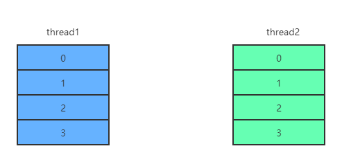

[toc]

# ConcurrentHashMap

## 原因

在`JDK1.7`版本中，并发场景下使用`HashMap`，调用`put()`触发扩容时，可能导致死循环。致使CPU使用率接近100%。

这是因为在并发场景下，可能导致`HashMap`的`Entry`形成环形数据结构，则`Entry`的`next`结点永远不为空，就会产生死循环。

## 1.7中HashMap死循环分析

### 扩容流程

`put()`触发扩容过程如下

1. 调用`addEntry()`

   如果`size`超过`threshold(临界值)`且`bucketIndex(桶序号)`不为空，将调用`resize()`方法生成一个长度为原来两倍的`newTable`对象。

2. 调用`transfer()`

   在`transfer()`中，轮询`table`数组每个位置，将其各个元素算出新位置后放到`newTable`上。

   ``` java
    void transfer(Entry[] newTable) {
        Entry[] src = table;                   //src引用了旧的Entry数组
        int newCapacity = newTable.length;
        for (int j = 0; j < src.length; j++) { //遍历旧的Entry数组
            Entry<K,V> e = src[j];             //取得旧Entry数组的每个元素
            if (e != null) {
                src[j] = null;//释放旧Entry数组的对象引用（for循环后，旧的Entry数组不再引用任何对象）
                do {
                    Entry<K,V> next = e.next;
                    int i = indexFor(e.hash, newCapacity); //！！重新计算每个元素在数组中的位置
                    e.next = newTable[i]; //标记[1]
                    newTable[i] = e;      //将元素放在数组上
                    e = next;             //访问下一个Entry链上的元素
                } while (e != null);
            }
        }
    }
   ```

> JDK1.7中HashMap在扩容时采用`头插法`。

在单线程环境下，这段代码能成功扩容。但如果在并发环境下呢？

假设存在一个`HashMap`对象，其内部`table`如下图所示：


在并发场景下进行扩容时，首先生成一个长度为`2*table.length`的`newTable`对象。假设有两个线程`thread1`和`thread2`，那么在各自的栈帧中将生成两个`newTable`。



**这时`thread1`执行到`Entry<K, V> next = e.next;`后挂起**，轮到`thread2`执行。当`thread2`完成扩容后，结果如下：


由于`thread1`与`thread2`中引用的在堆中`table`对象为同一个。当`thread2`完成扩容后，`A1结点`和`A2结点`在堆中分布如上图所示。这时`thread1`获得时间片重新执行。这时在`thread1`的内存栈中：

`e = A1; next = A2`

在第一次迭代后，`newTable`为：`-> A1 -> null`，`e = A2`

在第二次迭代时，由于`thread2`更新了`A2.next`，`next = e.next = A2.next = A1 `

根据`头插法`，`newTable`结构为：`-> A2 -> A1 -> null`，`e = A1`

在第三次迭代时，`e = A1, next = null`，

最终导致`thread1`扩容后的`table`为：


循环列表产生后，一旦线程查找`A3`、`A4`......等结点无法找到时，则会进入死循环，将CPU

到100%。

## ConcurrentHashMap实现

- **原理**

  分段锁(先获取锁，再获取数据)。

### JDK1.7

在`ConcurrentHashMap`中，声明了一个`Segment[] segments`中则有类似`HashMap`中的**散列链表**数据结构——`HashEntry[] table`。`Segment`的中文意思是分段，片段。`nodes对象`就是我们所说的**分段锁**。

> `Segment`是`ReentrantLock`(可重入锁)的子类。

### 构造函数

``` java
public ConcurrentHashMap(
	int initialCapacity,
    float loadFactor,
    int concurrencyLevel
    ...
)
```

- **initialCapacity:**	初始化容量

- **loadFactor:**	负载因子用于扩容，缺省0.75f(0.75f是一个较为合理的经验值)。

- **concurrencyLevel:**	并发级别，缺省`DEFAULT_CONCURRENCY_LEVEL = 16`。

  这个参数是用户估计的并发级别，即有多少个线程共同修改这个`ConcurrentHashMap`。实际是`ConcurrentHashMap`的分段锁个数。当用户设置并发度时，`ConcurrentHashMap`将使用大于等于该值的2的最小幂指数作为实际并发度。

  如果并发度设置过小，可能带来严重的锁竞争问题；如果设置过大，原本对同一个`Segment`的访问可能扩散到多个`Segment`上。

`ConcurrentHashMap`将根据这三个参数来初始化`segment数组`、`segmentShift段偏移量`、`segmentMask段掩码`。

``` java
long u = ((h >>> segmentShift) & segmentMask) << SSHIFT) + SBASE;
```

> - `segmentShift`与`segmentMask`
>
> 这两个全局变量需要在定位`segment`时的散列算法中使用。

``` java
int cap = MIN_SEGMENT_TABLE_CAPACITY;
while (cap < c)
    cap <<= 1;
Segment<K,V> s0 = new Segment<K, V>(loadFactor, (int)(cap * loadFactor), (HashEntry<K, V>[]) new HashEntry[cap]);
Segment<K,V> ss = (Segment<K,V>[])new Segment[ssize];
UNSAFE.putOrderedObject(ss, SBASE, s0);
this.segments = ss;
```

`ConcurrentHashMap`会首先使用`Wang/Jenkins hash算法`对元素的`hashCode`进行再一次散列以令分布更均匀。

### get()

由于`ConcurrentHashMap`使用分段锁`Segment`来保护不同段的数据，那么在插入和获取元素的时候，需要进行以下步骤：

1. 定位`Segment`

   ``` java
   int h = hash(key);
   long u = ((h >>> segmentShift) & segmentMask) << SSHIFT) +SBASE; // 使用hash高位进行定位
   ```

2. 定位`HashEntry`，使用`hash`的全部位数进行定位

3. 对链表进行遍历

`ConcurrentHashMap`允许多个读操作并发进行，读操作并不需要加锁。`ConcurrentHashMap`的`get()`通过`volatile关键字`与`final关键字`保证读取到最新的数据：

``` java
static final class HashEntry<K,V> {
    final int hash;
    final K key;
    volatile V value;
    volatile HashEntry<K, V> next;
    ......
}
```

### put()

`put()`主要通过以下步骤：

1. 定位`Segment`

2. 定位`HashEntry`

3. `ensureSegment()`：初始化槽(`Segment`)

   在`ensureSegment()中,在并发场景下通过循环CAS操作保证仅有一个线程可以被初始化成功`

   ``` java
   public V put(K key, V value) {
       Segment<K, V> s;
       if (value == null) 
           throw new NullPointerException();
       int hash = hash(key);
       int j = (hash >>> segmentShift) & segmentMask;
       if (( s= (Segment<K, V>)UNSAFE.getObject(segments, (j << SSHIFT) + SBASE)) == null)
           s = ensureSegment(j);
       return s.put(key, hash, value, false);
   }
   ```

4. 调用`Segment`的`put()`

   首先通过`tryLock()`尝试获取锁，获取失败时调用`scanAndLockForPut()`。在这个方法中，首先通过循环CAS获取锁，在重试超过一定次数后(依CPU核心数而定)，则阻塞式获取锁。

   > 在等待锁的过程中可能已经将`HashEntry`创建好，所以在拿到锁后首先对`HashEntry`进行判空操作。

   ``` java 
   // Segment.put(...)
   while (!tryLock()) {
       HashEntry<K, V> f;
       if (retries < 0) {
           if (e == null) {
               if (node == null)
                   node = new HashEntry<K, V>(hash, key, value, retries = 0);
           }
           else if (key.equals(e.key))
               retries = 0;
           else
               e = e.next;
       }
       else if (++retries > MAX_SCAN_RETRIES) {
           lock();
           break;
       }
       else if ((retries & 1) == 0 && (f = entryForHash(this, hash)) != first) {
           e = firest = f;
           retries = -1;
       }
   }
   return node;
   ```

### 扩容rehash()

为了避免让所有的结点进行复制操作，故扩容时基于2的幂指数进行扩容。

假设扩容前某结点`index = i，容量 = capacity`。

则扩容后该结点的`index`为`i`或`i+capacity`。

> 在JDK1.7中HashMap的散列函数为`hashCode & (length - 1)`，这个函数等价于`hashCode % length`。

由上可见，部分结点扩容前后顺序不变，可以快速定位与重排。

### 弱一致性

由于在遍历过程中其他线程可能对链表结构做了调整，因此`get()`和`containsKey()`返回的可能是过时的数据。

这是`ConcurrentHashMap`在**弱一致性**上的体现。如果要求**强一致性**，那么必须使用`Collections.synchronizedMap()`。

### size()与containsValue()

这两个方法是基于整个`ConcurrentHashMap`来进行操作的，他们的原理也基本类似：首先不加锁遍历所有的`Segment`，获得所有对应的值以及所有`Segment`的`modcount`之和。

在put，remove和clean方法里操作元素前都会将变量`modCount`进行变动。如果连续两次所有`Segment`的`modCount`和相等，且过程中没有其他线程修改`ConcurrentHashMap`，则返回结果。

当循环次数超过预定义的值时，**需要对所有的`Segment`依次进行加锁**，获取返回值后再依次解锁。

所以应该避免在多线程环境下使用`size()`和`containsValue()`。

> 故当对元素判空时，应该使用`isEmpty()`。

## 使用

- **putIfAbsent():**	如果不存在则插入