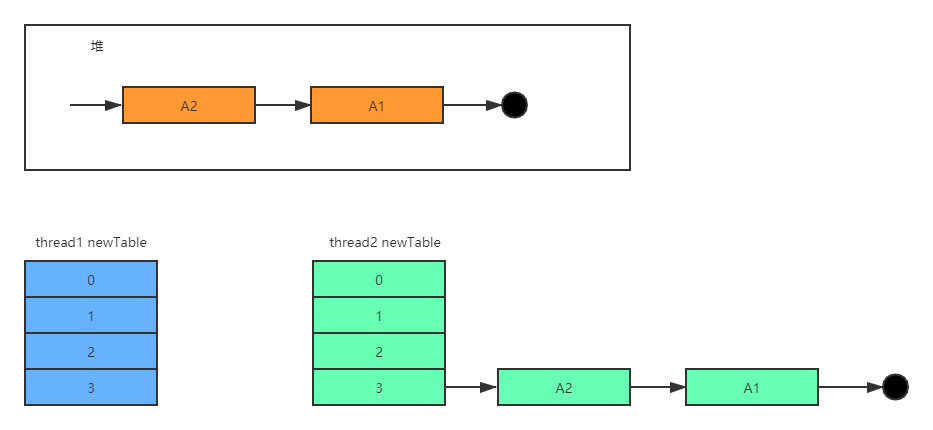

[toc]

# ConcurrentHashMap

## 原因

在`JDK1.7`版本中，并发场景下使用`HashMap`，调用`put()`触发扩容时，可能导致死循环。致使CPU使用率接近100%。

这是因为在并发场景下，可能导致`HashMap`的`Entry`形成环形数据结构，则`Entry`的`next`结点永远不为空，就会产生死循环。

## 1.7中HashMap死循环分析

### 扩容流程

`put()`触发扩容过程如下

1. 调用`addEntry()`

   如果`size`超过`threshold(临界值)`且`bucketIndex(桶序号)`不为空，将调用`resize()`方法生成一个长度为原来两倍的`newTable`对象。

2. 调用`transfer()`

   在`transfer()`中，轮询`table`数组每个位置，将其各个元素算出新位置后放到`newTable`上。

   ``` java
    void transfer(Entry[] newTable) {
        Entry[] src = table;                   //src引用了旧的Entry数组
        int newCapacity = newTable.length;
        for (int j = 0; j < src.length; j++) { //遍历旧的Entry数组
            Entry<K,V> e = src[j];             //取得旧Entry数组的每个元素
            if (e != null) {
                src[j] = null;//释放旧Entry数组的对象引用（for循环后，旧的Entry数组不再引用任何对象）
                do {
                    Entry<K,V> next = e.next;
                    int i = indexFor(e.hash, newCapacity); //！！重新计算每个元素在数组中的位置
                    e.next = newTable[i]; //标记[1]
                    newTable[i] = e;      //将元素放在数组上
                    e = next;             //访问下一个Entry链上的元素
                } while (e != null);
            }
        }
    }
   ```

> JDK1.7中HashMap在扩容时采用`头插法`。

在单线程环境下，这段代码能成功扩容。但如果在并发环境下呢？

假设存在一个`HashMap`对象，其内部`table`如下图所示：


在并发场景下进行扩容时，首先生成一个长度为`2*table.length`的`newTable`对象。假设有两个线程`thread1`和`thread2`，那么在各自的栈帧中将生成两个`newTable`。


**这时`thread1`执行到`Entry<K, V> next = e.next;`后挂起**，轮到`thread2`执行。当`thread2`完成扩容后，结果如下：



由于`thread1`与`thread2`中引用的在堆中`table`对象为同一个。当`thread2`完成扩容后，`A1结点`和`A2结点`在堆中分布如上图所示。这时`thread1`获得时间片重新执行。这时在`thread1`的内存栈中：

`e = A1; next = A2`

在第一次迭代后，`newTable`为：`-> A1 -> null`，`e = A2`

在第二次迭代时，由于`thread2`更新了`A2.next`，`next = e.next = A2.next = A1 `

根据`头插法`，`newTable`结构为：`-> A2 -> A1 -> null`，`e = A1`

在第三次迭代时，`e = A1, next = null`，

最终导致`thread1`扩容后的`table`为：


循环列表产生后，一旦线程查找`A3`、`A4`......等结点无法找到时，则会进入死循环，将CPU消耗到100%。